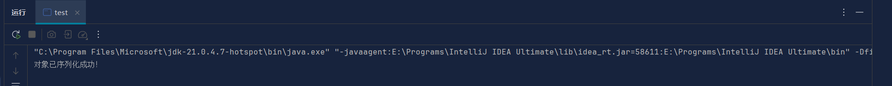
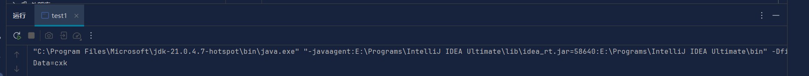

# 会话技术——扩展作业

## 1.会话安全性

- ### 会话劫持和防御

  **中间人攻击**：攻击者位于通信双方之间，拦截并篡改通信数据，攻击者获取会话标识符，伪装成用户与服务器进行交互，从而劫持会话。

  **防范措施**：对会话进行加密，确保通信数据在传输过程中不被窃取和篡改；对关键数据进行数字签名，以验证数据的完整性和真实性

  **会话固定攻击**：攻击者先在目标网站上创建一个会话，并获取对应的会话标识符。然后，攻击者通过各种方式诱导用户使用这个预先创建好的会话进行登录。例如，发送包含特定链接的电子邮件或消息，当用户点击链接时，就会使用攻击者预先设置好的会话进行访问。一旦用户登录，攻击者就可以利用这个固定的会话标识符劫持用户的会话。

  **防范措施**：服务器在用户登录后应生成新的会话标识符，避免使用用户可能被诱导使用的固定会话。对用户输入的链接进行严格的验证和过滤，防止恶意链接的传播。

- ### 跨站脚本攻击（XSS）和防御

  **攻击方式**：攻击者将恶意脚本注入到目标网站中，从而在用户浏览器中执行。当用户访问被攻击的网站时，恶意脚本会被执行。

  分为三种类型：

  1. **反射型 XSS**：攻击者通过诱使用户点击恶意链接，将恶意脚本作为参数传递给目标网站。服务器将恶意脚本反射回用户浏览器并执行。

  2. **存储型 XSS**：攻击者将恶意脚本存储在目标网站的数据库中，当其他用户访问包含恶意脚本的页面时，恶意脚本被执行。

  3. **DOM 型 XSS**：攻击者通过修改页面的 DOM 结构，在用户浏览器中执行恶意脚本。这种攻击方式不需要与服务器交互，完全在客户端进行。

     **防范措施：**

     1. 输入验证和过滤：对用户输入的数据进行严格的验证和过滤，去除可能包含恶意脚本的字符。可以使用正则表达式或白名单机制来限制输入的内容。
     2. 输出编码：在将用户输入的数据显示在页面上时，对其进行 HTML 编码，防止恶意脚本被执行。例如，将 “<” 编码为 “<”，将 “>” 编码为 “>”。
     3. 设置 HTTP 头部：设置合适的 HTTP 头部，如 “Content-Security-Policy”，可以限制页面中可以加载的资源，防止恶意脚本的注入。
     4. 使用安全的开发框架：许多现代的开发框架都提供了内置的安全功能，可以帮助开发者防止 XSS 攻击。例如，Django 和 Ruby on Rails 等框架都有强大的安全机制。
     5. 定期进行安全审计：对网站进行定期的安全审计，及时发现和修复潜在的安全漏洞。可以使用自动化的安全扫描工具，也可以聘请专业的安全团队进行审计。

  

- ### 跨站请求伪造（CSRF）和防御

  **攻击方式**：用户访问恶意网站后，该恶意网站向用户已登录的目标网站发送伪造的请求。利用用户已登录的身份，在用户不知情的情况下，以用户的名义执行恶意操作。

  **防范措施**：

  1. 使用验证码：在关键操作（如修改密码、转账等）时，要求用户输入验证码。验证码可以有效地防止自动化的 CSRF 攻击，因为攻击者很难自动获取和输入正确的验证码。
  2. 检查 Referer 字段：服务器可以检查请求的 Referer 字段，以确定请求是否来自合法的源。如果 Referer 字段不合法，服务器可以拒绝该请求。然而，这种方法并不是完全可靠的，因为 Referer 字段可以被伪造。
  3. 使用 Token：在用户登录后，服务器为用户生成一个唯一的 Token，并将其包含在每个请求中。服务器在处理请求时，会检查 Token 的有效性。如果 Token 无效，服务器可以拒绝该请求。Token 可以有效地防止 CSRF 攻击，因为攻击者很难获取到用户的 Token。
  4. 限制请求方法：对于一些敏感操作，可以限制只允许特定的请求方法（如 POST 请求）。这样可以增加攻击者的难度，因为他们需要伪造更复杂的请求。
  5. 教育用户：提高用户的安全意识也是防御 CSRF 攻击的重要措施。用户应该注意不要随意点击来自不明来源的链接，不要在不可信的网站上输入自己的登录凭证

## 2.分布式会话管理

- ### 分布式环境下的会话同步问题

  在分布式系统中，通常会有多个服务器节点来处理用户请求。当用户与系统进行交互时，会话信息需要在不同的服务器节点之间保持一致，以便为用户提供连续的服务体验。由于分布式系统的特性，出现了会话同步问题。

  首先，负载均衡策略可能导致用户的请求被分发到不同的服务器节点上。如果会话信息只存储在单个服务器节点上，那么当用户的下一个请求被分发到另一个服务器节点时，该节点可能无法获取到用户的会话信息，从而导致用户需要重新登录或丢失之前的操作状态。

  其次，服务器节点的故障或动态扩展也会影响会话同步。如果一个存储了用户会话信息的服务器节点出现故障，那么需要有一种机制能够将用户的会话信息迁移到其他正常的服务器节点上，以保证服务的连续性。

- ### Session集群解决方案

  **一、Session 复制**

  1. 原理：

     Session 复制是将用户的会话数据在多个服务器节点之间进行同步复制。当用户在一个节点上创建或更新会话时，该会话数据会被复制到其他节点上。这样，无论用户的请求被分发到哪个节点，都可以获取到相同的会话数据。

  2. 优点：

     实现相对简单，不需要对应用程序进行大量的修改。

  3. 缺点：

     开销较大，特别是在大规模集群中， Session 复制方式会占用大量的网络带宽和存储。

     可能会出现数据一致性问题，如果 Session 复制过程中出现故障，可能会导致不同节点上的 Session 数据不一致。

  **二、Session 集中存储**

  1. 原理：

     将用户的 Session 数据存储在一个集中的存储系统中，如数据库、缓存服务器等。

     当用户的请求到达服务器节点时，节点从集中存储中读取用户的 Session 数据，并在处理请求后将更新后的 Session 数据写回集中存储。

  2. 优点：

     避免了一致性问题，因为只有一个集中的存储位置。

     可以方便地进行扩展，只需要增加存储系统的容量即可。

     可以与其他分布式系统组件进行集成，如负载均衡器、缓存服务器等。

  3. 缺点：

     引入了额外的存储系统，增加了系统的复杂性和维护成本。

     可能会成为性能瓶颈，如果存储系统的读写性能不足，可能会影响整个系统的响应速度。

     需要对存储系统进行高可用性配置，以确保在存储系统出现故障时，用户的 Session 数据不会丢失。

  **三、基于 Cookie 的 Session**

  1. 原理：

     将用户的 Session 数据存储在客户端的 Cookie 中。

     当用户的请求到达服务器节点时，节点从 Cookie 中读取用户的 Session 数据，并在处理请求后将更新后的 Session 数据写回 Cookie。

  2. 优点：

     不需要在服务器端进行 Session 管理，减少了服务器的存储和网络开销。

     可以实现跨域访问，因为 Cookie 是在客户端存储的，可以在不同的域名下共享。

  3. 缺点：

     Cookie 的大小有限制，不能存储大量的 Session 数据。

     Cookie 可能会被用户禁用或删除，导致用户的 Session 数据丢失。

     安全性较低，因为 Cookie 中的数据可以被客户端篡改。

- ### 使用Redis等缓存技术实现分布式会话

  1. 原理：

     使用分布式缓存系统，如 Redis、Memcached 等，它们一种内存数据库，具有极快的读写速度，支持分布式部署，可以在多个节点上运行，可以配置数据持久化，防止数据丢失。当用户的请求到达服务器节点时，节点从缓存系统中读取用户的 Session 数据，并在处理请求后将更新后的 Session 数据写回缓存系统。

  2. 优点：

     可以提供高可用性和高性能，因为分布式缓存系统通常具有快速的读写速度和自动故障转移功能。

     可以方便地进行扩展，只需要增加缓存节点的数量即可。

     可以与其他分布式系统组件进行集成，如负载均衡器、应用服务器等。

  3. 缺点：

     需要引入额外的缓存系统，增加了系统的复杂性和维护成本。

     可能会出现缓存一致性问题，如果缓存系统中的数据与数据库中的数据不一致，可能会导致应用程序出现错误。

     需要对缓存系统进行高可用性配置，以确保在缓存系统出现故障时，用户的 Session 数据不会丢失。

## 3.**会话状态的序列化和反序列化**

- ### 会话状态的序列化和反序列化

  定义：序列化是将对象转换为可以存储或传输的格式的过程。在会话状态的上下文中，序列化通常是将包含会话数据的对象转换为字节流或字符串。

  反序列化是将序列化后的格式转换回对象的过程。在会话状态的上下文中，反序列化通常是将从存储中读取的字节流或字符串转换回包含会话数据的对象。

- ### 为什么需要序列化会话状态

  存储会话状态：将会话数据序列化后，可以将其存储在持久化存储中，以便在服务器重启或故障恢复时能够恢复会话状态。

  跨网络传输：如果需要在不同的服务器或服务之间传递会话状态，序列化可以将会话数据转换为可以通过网络传输的格式。

- ### Java对象序列化

  Java 中的序列化：Java 提供了内置的序列化机制，可以通过实现 `java.io.Serializable` 接口来使对象可序列化。在序列化过程中，Java 会将对象的状态转换为字节流，并可以通过 `ObjectOutputStream` 和 `ObjectInputStream` 进行读写操作。

  序列化例：

  ```Java
  import java.io.*;
  class demo implements Serializable{
      private String Data;
      public demo(String Data){
          this.Data=Data;
      }
      public String getData(){
          return Data;
      }
  }
  public class test{
      public static void main(String[] args) {
          try {
              demo demo1 = new demo("cxk");
              FileOutputStream fileOut = new FileOutputStream("demo1.ser");
              ObjectOutputStream out = new ObjectOutputStream(fileOut);
              out.writeObject(demo1);
              out.close();
              fileOut.close();
  
              System.out.println("对象已序列化成功！");
          } catch (Exception e) {
              throw new RuntimeException(e);
          }
      }
  }
  
  ```

  运行结果：

  

  反序列化例：

  ```java
  import java.io.FileInputStream;
  import java.io.ObjectInputStream;
  
  public class test1 {
      public static void main(String[] args) {
          try {
              FileInputStream fileIn = new FileInputStream("demo1.ser");
              ObjectInputStream in = new ObjectInputStream(fileIn);
              demo demo2 = (demo) in.readObject();
              in.close();
              fileIn.close();
              System.out.println("Data=" + demo2.getData());
          } catch  (Exception e) {
              throw new RuntimeException(e);
          }
      }
      }
  ```

  运行结果：

  

- ### 自定义序列化策略

  自定义序列化策略在 Java 中非常有用，可以更好地控制对象的序列化和反序列化过程。以下是一些关于自定义序列化策略的重要方面：

  **一、为什么需要自定义序列化策略？**

  1. 数据安全和隐私：某些敏感信息可能不希望在序列化过程中被暴露或存储。通过自定义序列化，可以选择性地排除特定字段或对敏感数据进行加密处理。
  2. 优化存储和传输：默认的序列化机制可能会产生较大的字节流，尤其是对于复杂对象。自定义策略可以压缩数据、去除不必要的信息或采用更高效的编码方式，以减少存储需求和网络传输时间。
  3. 版本控制：当对象的结构发生变化时，默认序列化可能会导致兼容性问题。通过自定义序列化，可以更好地处理版本差异，确保旧版本的序列化数据能够被正确地反序列化到新版本的对象中。

  **二、实现自定义序列化策略的方法**

  1. 实现`writeObject`和`readObject`方法：
     - 如前面的示例所示，在类中定义私有的`writeObject`和`readObject`方法。这些方法可以完全控制对象的序列化和反序列化过程。
     - 在`writeObject`方法中，可以选择要序列化的字段，并以特定的格式写入输出流。在`readObject`方法中，按照相同的格式从输入流中读取数据并恢复对象的状态。
     - 注意，这种方法需要小心处理异常情况，确保序列化和反序列化过程的稳定性。
  2. 实现`Externalizable`接口：
     - 类可以实现`Externalizable`接口，这要求提供`writeExternal`和`readExternal`方法来完全控制序列化和反序列化。
     - 与使用`writeObject`和`readObject`方法相比，`Externalizable`接口提供了更底层的控制，但也需要更多的代码实现。
     - 在`writeExternal`方法中，将对象的状态写入输出流。在`readExternal`方法中，从输入流中读取数据并恢复对象的状态。

  **三、注意事项**

  1. 版本兼容性：在自定义序列化策略时，要考虑到不同版本的对象可能需要进行序列化和反序列化。尽量采用灵活的方式，以便能够处理旧版本的数据和适应未来的变化。
  2. 异常处理：在序列化和反序列化过程中，可能会出现各种异常情况，如输入输出错误、类未找到等。要妥善处理这些异常，以确保程序的稳定性和可靠性。
  3. 安全性：如果序列化的数据包含敏感信息，要采取适当的安全措施，如加密、访问控制等，以防止数据泄露。
  4. 性能考虑：自定义序列化策略可能会对性能产生影响。在设计策略时，要考虑到序列化和反序列化的效率，避免过度复杂的操作导致性能下降。

  总之，自定义序列化策略可以让你根据具体的需求来控制对象的序列化和反序列化过程。通过合理地设计和实现自定义策略，可以提高数据的安全性、优化存储和传输效率，并更好地处理版本兼容性问题。

