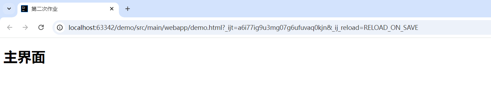
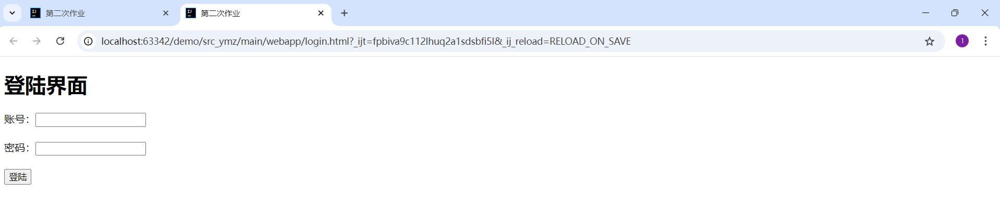
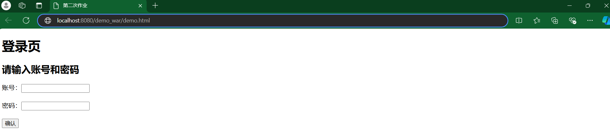
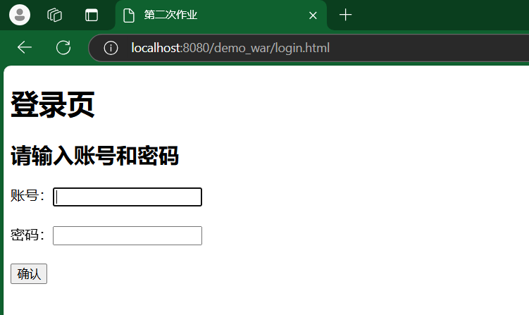
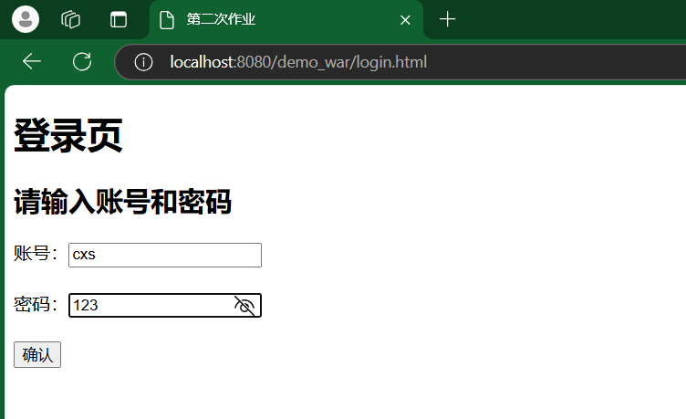
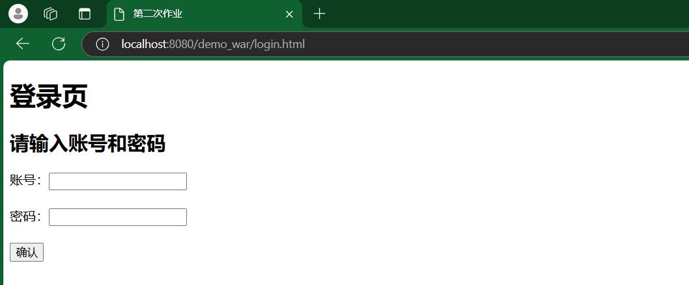
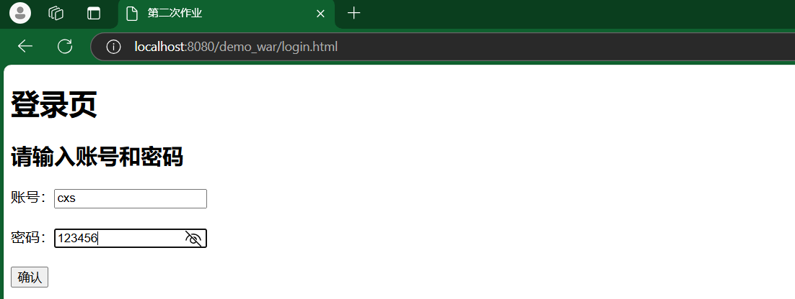
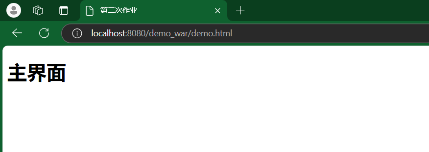
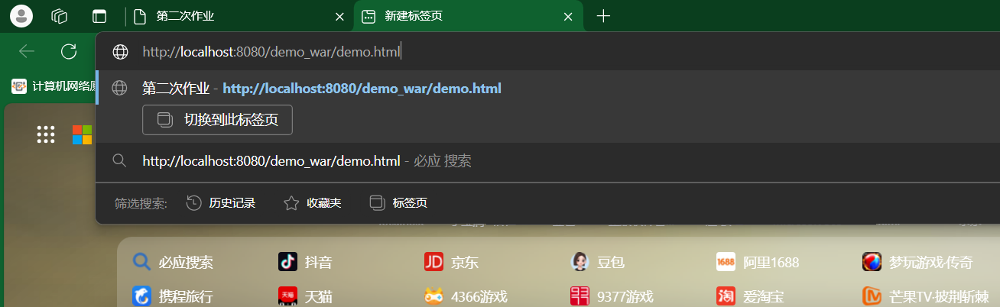
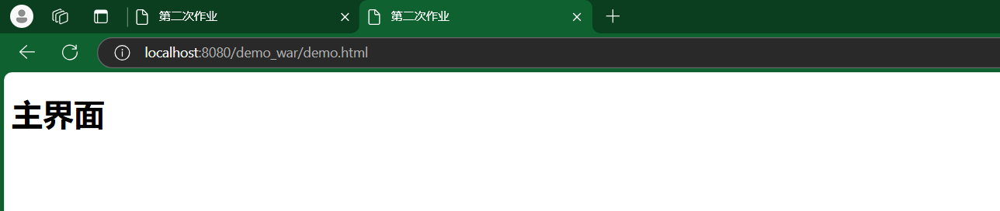

# 作业一：filter练习

## 1.网页部分

### 1.1主网页

```html
<!DOCTYPE html>
<html lang="en">
<head>
    <meta charset="UTF-8">
    <title>第二次作业</title>
</head>
<body>
<h1>主界面</h1>
</body>
</html>
```

展示：



### 1.2登录页面

```html
<!DOCTYPE html>
<html lang="en">
<head>
    <meta charset="UTF-8">
    <title>第二次作业'chi</title>
</head>
<body>
<h1>登陆界面</h1>
<form>
    <label>
        账号：<input type="text"  id="account">
    </label>
    <br>
    <br>
    <label>
        密码：<input type="password"id="password">
    </label>
    <br>
    <br>
    <button id="btn" type="button">登陆</button>
</form>

<script>
    const btn=document.getElementById('btn')
    btn.addEventListener('click',function (){
        const account=document.getElementById('account').value
        const password=document.getElementById('password').value
        const json={
            "account":account,
            "password":password
        }
        const xhr=new XMLHttpRequest()
        xhr.open('POST','LoginServlet')
        xhr.onreadystatechange=function(){
            if(xhr.readyState===4 && xhr.status===200){
                const resultJson = JSON.parse(xhr.responseText)
                if(resultJson["result"]===true){
                    //登陆成功直接跳转去主页
                    location.href='main.html'
                }else {
                    alert('登陆失败，请检查账号密码是否错误！')
                }
            }
        }
        xhr.send(JSON.stringify(json))
    })
</script>
</body>
</html>
```

展示：



## 2.服务端部分

### 2.1.`loginservlet`类

```java
import jakarta.servlet.ServletException;
import jakarta.servlet.annotation.WebServlet;
import jakarta.servlet.http.HttpServlet;
import jakarta.servlet.http.HttpServletRequest;
import jakarta.servlet.http.HttpServletResponse;
import jakarta.servlet.http.HttpSession;

import java.io.IOException;
import java.io.PrintWriter;

@WebServlet("/login")
public class loginservlet extends HttpServlet {

    @Override
    protected void doPost(HttpServletRequest request, HttpServletResponse response) throws ServletException, IOException {
        String username = request.getParameter("username");
        String password = request.getParameter("password");

        // 假设正确的用户名和密码固定为"cxs"和"123456"
        if ("cxs".equals(username) && "123456".equals(password)) {
            HttpSession session = request.getSession();
            session.setAttribute("username", username);
            response.sendRedirect(request.getContextPath()+"/demo.html");
        } else {
         response.setContentType("text/html;charset=UTF-8");
         PrintWriter out = response.getWriter();
        out.println("<html><body>");
         out.println("<h2>账号或密码错误，请重新登录。</h2>");
        out.println("</body></html>");
            response.sendRedirect(request.getContextPath()+"/login.html");
        }
    }
}
```

### **2.2.`loginfilter`类**

```java
import jakarta.servlet.*;
import jakarta.servlet.annotation.WebFilter;
import jakarta.servlet.http.HttpServlet;
import jakarta.servlet.http.HttpServletRequest;
import jakarta.servlet.http.HttpServletResponse;

import java.io.IOException;
import java.util.Arrays;
import java.util.List;
import java.util.logging.LogRecord;
@WebFilter("/*")
public class loginfilter implements Filter {
    private static  final List<String>STATIC_EXTENSIONS =Arrays.asList("/login","/login.html");

    @Override
    public void init(FilterConfig filterConfig) throws ServletException {
        Filter.super.init(filterConfig);
    }

    @Override
    public void doFilter(ServletRequest servletRequest, ServletResponse servletResponse, FilterChain filterChain) throws IOException, ServletException {
        HttpServletRequest request =(HttpServletRequest)servletRequest;
        HttpServletResponse response =(HttpServletResponse)servletResponse;

        boolean isStaticResource = STATIC_EXTENSIONS.stream().anyMatch(ext -> {
            System.out.println("ext:"+ext);
            return request.getRequestURI().contains(ext);
        });
        if(isStaticResource){
            filterChain.doFilter(servletRequest,servletResponse);
        }else {
            String username =(String)request.getSession().getAttribute("username");
            if("".equals(username)||username==null){
                response.sendRedirect(request.getContextPath()+"/login.html");
            }else {
                filterChain.doFilter(servletRequest,servletResponse);
            }
        }
    }

    @Override
    public void destroy() {
       Filter.super.destroy();
    }
}
```

## 3.功能测试

### 3.1.未登录时，直接访问主界面会转到登录界面

直接访问主界面：



结果：



### 3.2.登录密码错误时，会再次重定向到登录页

输入错误密码：



结果：



### 3.3.输入正确密码，跳转至主界面

输入正确密码：



结果：



### 3.4.登录后可直接访问主界面

在新网页访问主界面（已在左侧网页成功登录）：



结果：

