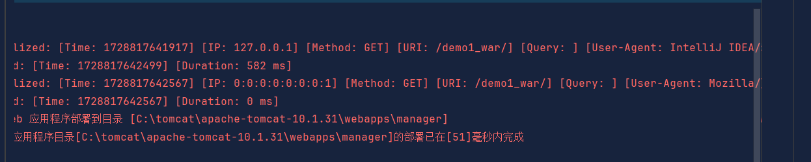

# 作业二：listener练习

## 1.`servletrequestlistener`类

作用：记录请求开始和结束的时刻，并记录所需信息

```java
import jakarta.servlet.*;
import jakarta.servlet.http.HttpServletRequest;
import java.util.logging.Logger;

public class servletrequestlistener implements ServletRequestListener {

    private static final Logger logger = Logger.getLogger(servletrequestlistener.class.getName());

    // 请求开始时的处理
    @Override
    public void requestInitialized(ServletRequestEvent sre) {
        ServletRequest servletRequest = sre.getServletRequest();

        if (servletRequest instanceof HttpServletRequest) {
            HttpServletRequest request = (HttpServletRequest) servletRequest;
            long startTime = System.currentTimeMillis();

            // 保存开始时间
            request.setAttribute("startTime", startTime);

            // 获取IP 地址、请求方法、URI、查询字符串、User-Agent
            String clientIp = request.getRemoteAddr();
            String method = request.getMethod();
            String requestUri = request.getRequestURI();
            String queryString = request.getQueryString() != null ? request.getQueryString() : "";
            String userAgent = request.getHeader("User-Agent") != null ? request.getHeader("User-Agent") : "Unknown";

            // 记录请求开始信息
            logger.info(String.format("Request Initialized: [Time: %s] [IP: %s] [Method: %s] [URI: %s] [Query: %s] [User-Agent: %s]",
                    startTime, clientIp, method, requestUri, queryString, userAgent));
        }
    }


    @Override
    public void requestDestroyed(ServletRequestEvent sre) {
        ServletRequest servletRequest = sre.getServletRequest();

        if (servletRequest instanceof HttpServletRequest) {
            HttpServletRequest request = (HttpServletRequest) servletRequest;
            long endTime = System.currentTimeMillis();

            // 获取开始时间
            Long startTime = (Long) request.getAttribute("startTime");
            if (startTime == null) {
                startTime = endTime;  // 如果没有开始时间，使用结束时间
            }

            // 计算处理时间
            long duration = endTime - startTime;
            logger.info(String.format("Request Completed: [Time: %s] [Duration: %d ms]", endTime, duration));
        }
    }
}
```

## 2.`testservlet`类

作用：测试`servletquestlistener`的日志功能。

```java
import jakarta.servlet.ServletException;
import jakarta.servlet.annotation.WebServlet;
import jakarta.servlet.http.HttpServlet;
import jakarta.servlet.http.HttpServletRequest;
import jakarta.servlet.http.HttpServletResponse;
import java.io.IOException;
import java.io.PrintWriter;

@WebServlet("/test")
public class testservlet extends HttpServlet {

    @Override
    protected void doGet(HttpServletRequest request, HttpServletResponse response)
            throws ServletException, IOException {
        response.setContentType("text/html");
        PrintWriter out = response.getWriter();
        out.println("<html><body>");
        out.println("<h1>Test Servlet</h1>");
        out.println("</body></html>");
    }

    @Override
    protected void doPost(HttpServletRequest request, HttpServletResponse response)
            throws ServletException, IOException {
        doGet(request, response);  
    }
}
```

## 3.测试结果

控制台日志显示如下图：

